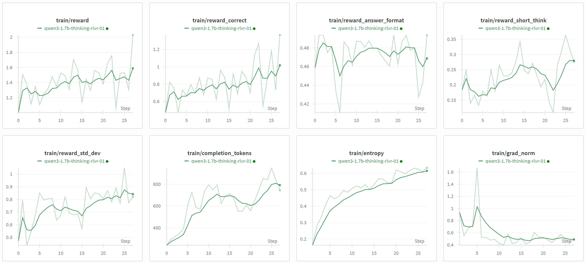
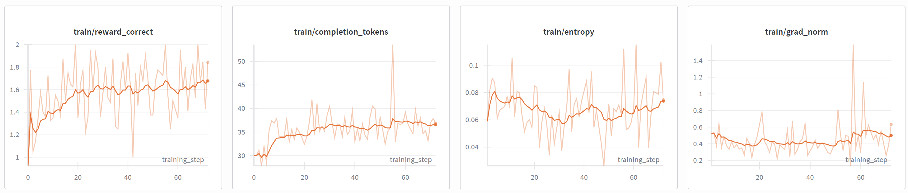

# Agentic RAG RL example

## 1. Set up environment

### 1.1 install deps

```bash
$ cd ../../
# install conda: https://github.com/conda-forge/miniforge
# setup cuda 12.8 with python 3.12
$ conda create -n art python==3.12 nvidia/label/cuda-12.8.1::cuda-toolkit

$ conda activate art
$ pip install -e .[backend]
$ cd torchtune && pip install -e .

$ pip freeze | egrep "vllm|unsloth|torch"
torch==2.7.1
torchao==0.14.1
torchaudio==2.7.1
torchdata==0.11.0
-e git+https://github.com/ninehills/torchtune.git@93c049bb1daa1232f4c327ac2590ec5ab00c0a2b#egg=torchtune&subdirectory=../../torchtune
torchvision==0.22.1
unsloth==2025.10.3
unsloth_zoo==2025.10.3
vllm==0.10.0

# We use FlashRAG to unified process the RAG dataset
$ pip install git+https://github.com/ninehills/FlashRAG.git
$ pip install -r requirements.txt
```

### 1.2 download data and models

```bash
$ cd examples/rag
$ export MODELS_DIR=~/models
$ hf download Qwen/Qwen3-1.7B --local-dir $MODELS_DIR/Qwen3-1.7B
$ hf download intfloat/e5-base-v2 --local-dir $MODELS_DIR/e5-base-v2
$ hf download --repo-type dataset yixuantt/MultiHopRAG --local-dir data/MultiHopRAG
```

### 1.3 Process the data and start mcp server

```bash
# convert dataset to FlashRAG format
python convert_multihop_rag.py

# split corpus to chunks
python corpus_to_chunk.py --input_path data/MultiHopRAG/corpus.jsonl --output_path data/MultiHopRAG/chunks.jsonl --chunk_by recursive --chunk_size 500 --tokenizer_name_or_path $MODELS_DIR/e5-base-v2

# build embedding index
python -m flashrag.retriever.index_builder \
  --retrieval_method e5 \
  --model_path $MODELS_DIR/e5-base-v2  \
  --corpus_path data/MultiHopRAG/chunks.jsonl \
  --save_dir data/MultiHopRAG/ \
  --use_fp16 \
  --max_length 512 \
  --batch_size 256 \
  --pooling_method mean \
  --instruction "passage: " \
  --faiss_type Flat

# build bm25 index
python -m flashrag.retriever.index_builder \
  --retrieval_method bm25 \
  --corpus_path data/MultiHopRAG/chunks.jsonl \
  --bm25_backend bm25s \
  --save_dir data/MultiHopRAG/

# start retriever mcp server
python retriever_mcp.py \
    --vector_index_path data/MultiHopRAG/e5_Flat.index \
    --bm25_index_path data/MultiHopRAG/bm25/ \
    --model_path $MODELS_DIR/e5-base-v2 \
    --instruction "query: " \
    --corpus_path data/MultiHopRAG/chunks.jsonl \
    --use_multi_retriever \
    --merge_method rrf \
    --device cpu \
    --top_k 3

# Debug
npx @modelcontextprotocol/inspector
## transport type: sse
## URL: http://127.0.0.1:8099/sse
```

### 1.4 Dockerfile

```bash
docker build -t art-rag-train:latest .
```

## 2. Test the agent

```bash
# Replace Qwen3 chat template to multiturn thinking template
$ cp -r $MODELS_DIR/Qwen3-1.7B $MODELS_DIR/Qwen3-1.7B-backup
$ python -c "tpl=open('./qwen3_multiturn_thinking_tpl.jinja').read();from transformers import AutoTokenizer; tokenizer = AutoTokenizer.from_pretrained('/home/cynic/models/Qwen3-1.7B'); tokenizer.save_pretrained('/home/cynic/models/Qwen3-1.7B', chat_template=tpl)"

# Start model vllm server，注意我们不进行 reasoning parser，避免think 的解析的错误
$ vllm serve $MODELS_DIR/Qwen3-1.7B --served-model-name Qwen3-1.7B  --max-model-len 8192 --enable-auto-tool-choice --tool-call-parser hermes --enforce-eager

# Run the agent
$ python deepsearch_agent.py run --base_url http://localhost:8000/v1 --api_key EMPTY --dataset ./data/MultiHopRAG/val.jsonl --prompt default --do_eval --model Qwen3-1.7B --output_dir output/default/Qwen3-1.7B/
Evaluation results: {'em': 0.36, 'f1': 0.36883333333333335, 'acc': 0.36, 'precision': 0.373, 'recall': 0.3671666666666667}
$ python analyze_trajectory.py --output_dir output/default/Qwen3-1.7B/ --with_eval
┏━━━━━━━━━━━━━━━━━━━━━━━━━━━┳━━━━━━━━━━━━━┳━━━━━━━━━━━━━┳━━━━━━━━━━━━━┓
┃ Metric                    ┃         All ┃     Success ┃     Failure ┃
┡━━━━━━━━━━━━━━━━━━━━━━━━━━━╇━━━━━━━━━━━━━╇━━━━━━━━━━━━━╇━━━━━━━━━━━━━┩
│ Avg Rounds                │ 1.93 ± 0.49 │ 1.90 ± 0.38 │ 1.94 ± 0.54 │
│ Avg Tool Calls            │ 0.98 ± 0.54 │ 0.99 ± 0.49 │ 0.98 ± 0.57 │
└───────────────────────────┴─────────────┴─────────────┴─────────────┘
```

## 3. Unsloth backend RL

Hardware: 1 x GTX4090 24GB

```bash
$ export MODELS_DIR=~/models
# set WANDB_API_KEY in env file
$ cp env.template .env
# Test the rollout
$ python art_rollout.py test "${MODELS_DIR}/Qwen3-1.7B" "Qwen3-1.7B" --max_seq_length 8192 --max_tokens 3072 --gpu_memory_utilization 0.6 --groups_per_step 10 --gradient_accumulation_steps 1 --rewards correct,short_think,answer_format --prompt_name default
# Run the RL training
$ python art_rollout.py train "${MODELS_DIR}/Qwen3-1.7B" "qwen3-1.7b-thinking-rlvr-01" --max_seq_length 8192 --max_tokens 3072 --gpu_memory_utilization 0.6 --groups_per_step 10 --gradient_accumulation_steps 1 --rewards correct,short_think,answer_format --prompt_name default --thinking_token_optimal 300 --think_token_max 1000
```

Known Issues:
1. mcp server need to be warmed up before training, you can start training first to observe whether it is normal, and then start formal training.
2. The training process may be hang up, you can just kill the process and re-run the training script to resume the training.

Train log: (unfinished but the reward looks increasing good)



## 4. Torchtune backend multi-gpu RL

hardware: 1 x GTX4090 24GB (for debug only)

```bash
$ export MODELS_DIR=~/models
$ export CUDA_VISIBLE_DEVICES=0

# Full training
$ python art_rollout.py train "${MODELS_DIR}/Qwen3-1.7B" "qwen3-1.7b-thinking-torchtune-00" --max_seq_length 8192 --max_tokens 3072 --gpu_memory_utilization 0.6 --groups_per_step 1 --gradient_accumulation_steps 4 --learning_rate 3e-6 --rewards correct,short_think,answer_format --prompt_name default --backend torchtune --torchtune_args '{"model": "qwen3_1_7b_instruct", "model_type": "QWEN3", "async_weight_syncing": true, "enable_activation_offloading": true, "tensor_parallel_dim": 1}'

# Lora training

```

hardware: 4 x L20 48GB (for normal training)

## 5. Serveless backend RL

```bash
# set wandb api keyh in .env
# only support OpenPipe/Qwen3-14B-Instruct model
python art_rollout.py train "OpenPipe/Qwen3-14B-Instruct" "qwen3-14b-rlvr-serverless-01" --max_seq_length 8192 --max_tokens 3072 --groups_per_step 10 --rewards correct,short_think,answer_format --prompt_name default --backend serverless --delete_ckpt_metric train/reward
```

Train log:



> reward_correct is between 0 - 2.
